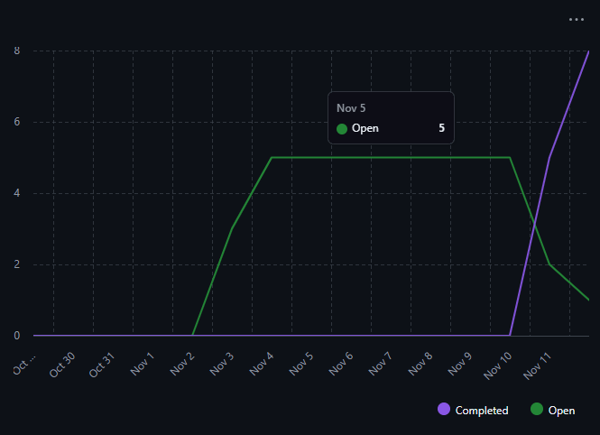
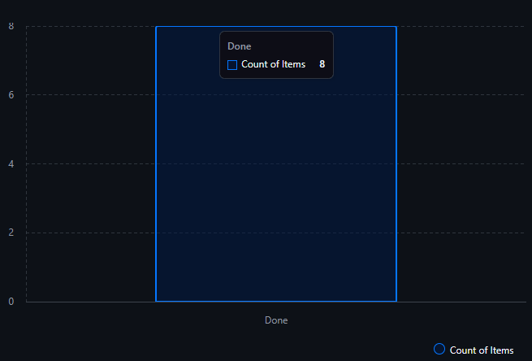

## Burndown

Aunque las tareas se vieron atrasadas y los sprints no "cuadraron" bien (debido a eso, se tiene una linea "plana" durante un tiempo), al final, se pudo observar como la línea que representaba las tareas completadas subió, mientras que las tareas "abiertas" (issues) fue disminuyendo.

## Issues completados

Los issues completados fueron aumentando conforme pasaban los sprints.

No se pudo lograr obtener las métricas de "Cycle time", "Blocked time" ni "%PR rechazados por políticas".